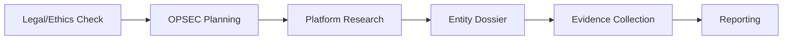

# Investigation Index

> **Quick Navigation:** Comprehensive guide to investigation procedures, platform-specific techniques, and entity profiling.

---

## 🎯 Investigation Workflow

### Standard Investigation Process



**Step-by-step:**
1. **Pre-Investigation:** [[Techniques/sop-legal-ethics|Legal & Ethics Review]] → [[Techniques/sop-opsec-plan|OPSEC Planning]]
2. **Collection Phase:** [[Techniques/sop-collection-log|Collection Logging]] + Platform SOPs + [[Techniques/sop-entity-dossier|Entity Dossier]]
3. **Specialized Techniques:** [[Techniques/sop-image-video-osint|Image/Video Analysis]] / [[Techniques/sop-web-dns-whois-osint|Web Infrastructure]] / [[Techniques/sop-financial-aml-osint|Financial Investigation]]
4. **Escalation (if needed):** [[Techniques/sop-sensitive-crime-intake-escalation|Sensitive Crime Escalation]]
5. **Closure:** [[Techniques/sop-reporting-packaging-disclosure|Reporting & Disclosure]]

---

## 📱 Platform-Specific SOPs

### Social Media Platforms

| Platform      | Primary Use Cases                                      | Difficulty | Link                              |                          |
| ------------- | ------------------------------------------------------ | ---------- | --------------------------------- | ------------------------ |
| **Twitter/X** | Real-time info, public discourse, journalists          | Medium     | [[Platforms/sop-platform-twitter-x | Twitter/X SOP]] |
| **Instagram** | Visual content, influencers, location tracking         | Easy       | [[Platforms/sop-platform-instagram | Instagram SOP]] |
| **TikTok**    | Youth demographics, viral trends, OSINT challenges     | Medium     | [[Platforms/sop-platform-tiktok    | TikTok SOP]]    |
| **LinkedIn**  | Professional networks, employment history, B2B         | Easy       | [[Platforms/sop-platform-linkedin  | LinkedIn SOP]]  |
| **Reddit**    | Anonymous communities, niche topics, AMAs              | Medium     | [[Platforms/sop-platform-reddit    | Reddit SOP]]    |
| **Telegram**  | Encrypted messaging, groups, channels                  | Hard       | [[Platforms/sop-platform-telegram  | Telegram SOP]]  |
| **Bluesky**   | Decentralized Twitter alternative, tech early adopters | Easy       | [[Platforms/sop-platform-bluesky   | Bluesky SOP]]   |

### Quick Platform Comparison

**Best for:**
- **Identity verification:** LinkedIn, Facebook
- **Real-time events:** Twitter/X, Telegram
- **Location intelligence:** Instagram, TikTok
- **Anonymous investigations:** Reddit, archived Twitter
- **Professional background:** LinkedIn
- **Visual evidence:** Instagram, TikTok
- **Encrypted comms analysis:** Telegram

---

## 🔍 Investigation Techniques

### Core Techniques

| Technique              | Description                                      | Difficulty | Link                               |                                |
| ---------------------- | ------------------------------------------------ | ---------- | ---------------------------------- | ------------------------------ |
| **Entity Dossier**     | Comprehensive person/org profiling               | Medium     | [[Techniques/sop-entity-dossier      | Entity Dossier Template]] |
| **Image/Video OSINT**  | Reverse search, geolocation, metadata            | Medium     | [[Techniques/sop-image-video-osint   | Image/Video Analysis]]    |
| **Web/DNS/WHOIS**      | Infrastructure attribution, domain pivoting      | Easy       | [[Techniques/sop-web-dns-whois-osint | Web Infrastructure]]      |
| **Financial/AML**      | Blockchain, company records, sanctions screening | Hard       | [[Techniques/sop-financial-aml-osint | Financial Investigation]] |
| **Collection Logging** | Evidence tracking, chain of custody              | Easy       | [[Techniques/sop-collection-log      | Collection Log]]          |

### Specialized Techniques

**Geolocation:**
- Image metadata (EXIF GPS coordinates)
- Shadow analysis & sun position (SunCalc)
- Landmark identification (Google Maps, OpenStreetMap)
- Reference: [[Techniques/sop-image-video-osint#Geolocation Techniques|Image OSINT - Geolocation]]

**Blockchain Analysis:**
- Wallet clustering (Chainalysis, Elliptic)
- Transaction tracing (Blockchain.info, Etherscan)
- Mixer detection (Tornado Cash, Wasabi)
- Reference: [[Techniques/sop-financial-aml-osint#Cryptocurrency Tracing|Financial OSINT - Crypto]]

**Infrastructure Pivoting:**
- WHOIS reverse lookup (registrant email)
- DNS history (SecurityTrails, DomainTools)
- IP reverse lookup (Shodan, Censys)
- SSL certificate transparency (crt.sh)
- Reference: [[Techniques/sop-web-dns-whois-osint#Infrastructure Pivoting|Web OSINT - Pivoting]]

---

## 👥 Entity Management

### Entity Types

- **Person:** [[Entity-Dossiers/entity-example-person|Example: Alex Rivera]] (crypto trader, tech influencer)
- **Organization:** [[Entity-Dossiers/entity-example-organization|Example: CryptoVault Solutions]] (offshore company, high-risk)
- **Domain:** (Create using [[Techniques/sop-entity-dossier|Entity Dossier Template]])
- **Cryptocurrency Wallet:** (Create using [[Techniques/sop-entity-dossier|Entity Dossier Template]])
- **Asset:** (Create using [[Techniques/sop-entity-dossier|Entity Dossier Template]])

### Entity Creation

**To create a new entity:**
1. Use [[Techniques/sop-entity-dossier|Entity Dossier Template]] as reference
2. Save in `Investigations/Entity-Dossiers/` folder
3. Name format: `entity-[type]-[identifier].md` (e.g., `entity-person-john-doe.md`)
4. Update entity type in frontmatter: `person | org | domain | wallet | asset`
5. Set risk level: `low | medium | high | critical`
6. Set confidence: `low | medium | high`

---

## 🛡️ Legal & Operational

### Pre-Investigation Requirements

**Legal Checklist:**
- [ ] Review [[Techniques/sop-legal-ethics|Legal & Ethics SOP]]
- [ ] Verify investigation scope and authorization
- [ ] Confirm jurisdiction and applicable laws
- [ ] Document legal basis for collection
- [ ] Identify sensitive crime triggers (see escalation SOP)

**OPSEC Checklist:**
- [ ] Review [[Techniques/sop-opsec-plan|OPSEC Planning SOP]]
- [ ] VPN/Tor configuration verified
- [ ] Burner accounts created (if needed)
- [ ] Browser fingerprinting protection enabled
- [ ] No personal accounts used for investigation
- [ ] Attribution risk assessed

### Escalation Procedures

**When to escalate:** [[Techniques/sop-sensitive-crime-intake-escalation|Sensitive Crime Escalation SOP]]

**Immediate escalation triggers:**
- Child safety concerns (CSAM, exploitation)
- Imminent threat to life
- Terrorism or national security
- Human trafficking indicators
- Active violent crime

**Escalation contacts:**
- NCMEC (child safety): 1-800-843-5678 or CyberTipline.org
- FBI (terrorism/national security): tips.fbi.gov
- Local law enforcement (imminent threats): 911
- Internal supervisor: [Contact info]

---

## 📊 Evidence & Reporting

### Evidence Collection

**Key practices:**
- Use [[Techniques/sop-collection-log|Collection Log SOP]] for all evidence
- Calculate hashes immediately (SHA-256 preferred)
  - See: [[../Security/Analysis/sop-hash-generation-methods|Hash Generation Methods]]
- Screenshot with timestamp & URL visible
- Archive websites (Archive.org, archive.is)
- Record chain of custody

**Evidence structure:**
```
/Evidence/
├── CASE-ID/
│   ├── screenshots/
│   ├── documents/
│   ├── videos/
│   ├── archives/
│   └── SHA256SUMS (hash verification file)
```

### Reporting

**Final report:** [[Techniques/sop-reporting-packaging-disclosure|Reporting & Disclosure SOP]]

**Report sections:**
1. Executive summary
2. Scope and methodology
3. Findings (organized by entity)
4. Evidence appendix (with hashes)
5. Recommendations
6. Legal disclaimers

---

## 🧰 Essential Tools

### Quick Tool Reference

**Search & Discovery:**
- Google Advanced Search, DuckDuckGo
- Shodan, Censys (internet-wide scanning)
- Wayback Machine (website archives)
- crt.sh (SSL certificate transparency)

**Social Media:**
- Nuclei (username enumeration)
- Social-Analyzer (social media OSINT)
- Twint (Twitter scraping - archived tweets)
- Nitter (Twitter privacy frontend)

**Image/Video:**
- Google Image Search, TinEye, Yandex
- InVID (video verification)
- ExifTool (metadata extraction)
- GeoGuessr, SunCalc (geolocation)

**Infrastructure:**
- WHOIS, dig, nslookup
- SecurityTrails, DomainTools
- BuiltWith (technology profiling)
- PublicWWW (source code search)

**Blockchain:**
- Blockchain.info, Etherscan
- Chainalysis Reactor (commercial)
- Wallet Explorer (Bitcoin clustering)

**Comprehensive tool lists:**
- Platform SOPs: Tool sections in each SOP
- Technique SOPs: Specialized tool references
- Main index: [[../00_START|00_START]] → Security section

---

## 📚 Related Resources

### Internal References
- **Main navigation:** [[../00_START|Vault Home (00_START)]]
- **Security tools:** [[../Security/Analysis/sop-malware-analysis|Malware Analysis]] | [[../Security/Analysis/sop-hash-generation-methods|Hash Generation]]
- **Pentesting:** [[../Security/Pentesting/sop-linux-pentest|Linux]] | [[../Security/Pentesting/sop-ad-pentest|Active Directory]]
- **CTF guides:** [[../CTF/Getting-Started|CTF Getting Started]]

### External Resources
- OSINT Framework: https://osintframework.com/
- Bellingcat Toolkit: https://docs.google.com/spreadsheets/d/18rtqh8EG2q1xBo2cLNyhIDuK9jrPGwYr9DI2UncoqJQ
- IntelTechniques Tools: https://inteltechniques.com/tools/
- SANS OSINT Summit: https://www.sans.org/cyber-security-training-events/
- Trace Labs OSINT VM: https://www.tracelabs.org/initiatives/osint-vm

---

## 🔄 Investigation Templates

### Quick Start Templates

**New Person Investigation:**
1. Create entity file from [[Techniques/sop-entity-dossier|template]]
2. Run username enumeration: `nuclei -tags osint -var user=username`
3. Check data breaches: Have I Been Pwned
4. Social media audit: [[Platforms/sop-platform-twitter-x|Twitter]], [[Platforms/sop-platform-linkedin|LinkedIn]], etc.
5. Image search: Google, TinEye, PimEyes
6. Log findings: [[Techniques/sop-collection-log|Collection Log]]

**New Organization Investigation:**
1. Create entity file from [[Techniques/sop-entity-dossier|template]]
2. Corporate records: [[Techniques/sop-financial-aml-osint#Company Registries|Company Registry Search]]
3. Domain analysis: [[Techniques/sop-web-dns-whois-osint|Web/DNS/WHOIS OSINT]]
4. Blockchain (if applicable): [[Techniques/sop-financial-aml-osint#Cryptocurrency Tracing|Crypto Tracing]]
5. Employee mapping: [[Platforms/sop-platform-linkedin|LinkedIn OSINT]]
6. Sanctions screening: [[Techniques/sop-financial-aml-osint#Sanctions Screening|AML Checks]]

**New Domain Investigation:**
1. WHOIS lookup: `whois domain.com`
2. DNS enumeration: `dig domain.com ANY`, subfinder
3. Certificate transparency: `curl -s "https://crt.sh/?q=%25.domain.com&output=json"`
4. Reverse IP: Shodan, Censys, SecurityTrails
5. Technology profiling: BuiltWith, Wappalyzer
6. Archive search: Wayback Machine

---

## 📋 Case Management

### Active Cases
```dataview
TABLE case_id, entity_type, risk, confidence, updated
FROM "Investigations/Entity-Dossiers"
WHERE type = "dossier"
SORT updated DESC
LIMIT 10
```

### High-Risk Entities
```dataview
TABLE name, entity_type, risk, case_id, analyst
FROM "Investigations/Entity-Dossiers"
WHERE type = "dossier" AND risk = "high" OR risk = "critical"
SORT updated DESC
```

### Pending Review
```dataview
TABLE name, entity_type, confidence, updated
FROM "Investigations/Entity-Dossiers"
WHERE type = "dossier" AND confidence = "low"
SORT updated DESC
```

---

## 🔔 Updates & Maintenance

**Last Updated:** 2025-10-05
**Index Version:** 2.0 (post-reorganization)
**Next Review:** 2025-11-05

**Recent Changes:**
- 2025-10-05: Complete rewrite after vault reorganization
- 2025-10-05: Added example entities (person, organization)
- 2025-10-05: Enhanced entity dossier template with comprehensive workflows
- 2025-10-05: Updated all SOP links to match new structure

**Upcoming:**
- [ ] Add domain entity example
- [ ] Add cryptocurrency wallet entity example
- [ ] Create case management template
- [ ] Add investigation workflow diagrams

---

**Quick Links:** [[../00_START|🏠 Home]] | [[Techniques/sop-legal-ethics|⚖️ Legal]] | [[Techniques/sop-opsec-plan|🔒 OPSEC]] | [[Techniques/sop-entity-dossier|👤 Entity Template]] | [[Techniques/sop-reporting-packaging-disclosure|📄 Reporting]]
